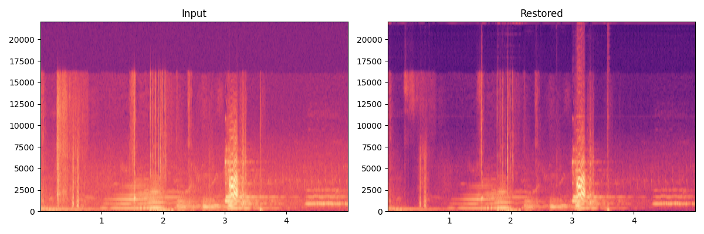

# RestoraX

**Open-source AI video restoration toolkit for old films, home videos, and archival footage.**

[](https://github.com/karailker/restorax/actions/workflows/ci.yml)
[](pyproject.toml)
[](pyproject.toml)
[](LICENSE)

RestoraX combines 25 restoration models (11 fully work today, 4 more run through classical fallbacks — see [Model status](#model-status)) plus an optional external DLSS 5 enhancer into a single, modular restoration pipeline with a **visual node-based pipeline builder**, REST API, and CLI — designed to be a competitive open-source alternative to Topaz Video AI and DaVinci Resolve Super Scale.

Beyond linear presets, RestoraX ships a **Pipeline DAG Engine** (typed ports, parallel branches, merge strategies, retry policies, per-branch progress) and a **ComfyUI-style visual builder** — drag restorers onto a canvas, wire them into branching graphs, and run them with live progress.

---

## What RestoraX Does

| Restoration Task | Models (25 total) | Input → Output |
|---|---|---|
| **Super-Resolution** (10) | Real-ESRGAN, BasicVSR++, MambaIR, VRT, Upscale-A-Video, TDM, SeedVR, EVTexture, FlashVSR, Waifu2x | SD → HD, HD → 4K |
| **Colorization** (1) | DDColor | Black & white → natural color |
| **Face Restoration** (4) | CodeFormer, CodeFormer++, GFPGAN, DICFace | Blurry faces → sharp |
| **Frame Interpolation** (1) | RIFE v4.22 | 24fps → 48fps, slow-motion |
| **Scratch & Dust Removal** (1) | ProPainter | Film scratches → clean |
| **Deinterlacing** (2) | AI Deinterlacer + YADIF | Combed fields → progressive |
| **Stabilization** (2) | GaVS + Deep Flow Stab | Shaky → smooth |
| **SDR → HDR** (1) | HDRTVDM (CVPR 2023) | SDR → HDR10 |
| **Audio Restoration** (3) | Demucs, VoiceFixer, RNNoise | Crackle/noise → clean |

---

## Quick Start

### 1. Install

```bash
git clone https://github.com/karailker/restorax && cd restorax
conda create -n restorax python=3.11 && conda activate restorax
pip install torch torchvision --index-url https://download.pytorch.org/whl/cu121
pip install -e . && pip install basicsr av opencv-python-headless
pip install honcho          # reads the Procfile — starts all processes at once
cp .env.example .env        # set RESTORAX_DEVICE, RESTORAX_MODEL_DIR, etc.
```

No GPU? Use `--index-url https://download.pytorch.org/whl/cpu` instead.

### 2. Start Redis

```bash
docker run -d -p 6379:6379 redis:7-alpine   # or: redis-server
```

### 3. Start the full stack

```bash
honcho start -f Procfile.dev
```

This starts four processes from [Procfile.dev](Procfile.dev):

| Process | URL | What it does |
|---|---|---|
| `api` | <http://localhost:8000> | FastAPI — REST API + WebSocket progress |
| `worker` | — | Celery — runs restoration jobs on GPU/CPU |
| `frontend` | <http://localhost:3000> | Vite + React 18 — visual pipeline builder (shadcn/ui + React Flow) |
| `flower` | <http://localhost:5555> | Celery monitor (optional) |

Start individual processes when needed:

```bash
honcho start -f Procfile.dev api worker     # headless — no frontend
honcho start -f Procfile.dev api            # API only
```

### 4. Restore a video

```bash
# CLI — single command, no server needed
restorax run --input old_film.mp4 --pipeline sr_x4
restorax run --input film.mp4 --pipeline classic_film --device cuda
restorax run --input vhs.mp4 --pipeline vhs_restoration
restorax run --input newsreel.mp4 --pipeline newsreel

# REST API
curl -X POST http://localhost:8000/jobs \
  -F "file=@film.mp4" -F "pipeline_id=sr_x4"
curl http://localhost:8000/jobs/{id}/download -o restored.mp4
```

### Docker (no local setup)

```bash
docker-compose -f docker-compose.dev.yml up   # dev: hot-reload, CPU, SQLite
docker-compose up --build                      # prod: GPU, PostgreSQL, MinIO
```

---

## Model status

Not every registered restorer ships working weights yet. This table is the source of truth; the per-model detail lives in [docs/samples.md](docs/samples.md).

| State | Models |
|---|---|
| **Ready** (real output, real weights) | Real-ESRGAN, VRT, DDColor, Waifu2x, EvTexture, CodeFormer, GFPGAN, ProPainter (scratch removal), YADIF, Demucs, VoiceFixer |
| **Classical fallback** (no neural weights wired) | RIFE, Video Stabilization, GaVS, RNNoise |
| **Needs work** (public weights/code exist, adapter unfinished) | BasicVSR++, HDRTVDM, DicFace, AI Deinterlace |
| **GPU only** (upstream needs CUDA-only kernels or very large VRAM; not implemented) | MambaIR, FlashVSR, SeedVR, Upscale-A-Video |
| **Unavailable** (no public release found) | CodeFormer++, TDM |

The evidence behind each status lives in [`restorax/models_catalog.py`](restorax/models_catalog.py) and is printed by `restorax download-models`. Details and samples: [docs/samples.md](docs/samples.md).

Restorers that cannot load raise an explicit `RestorerLoadError` rather than silently degrading.

### DLSS 5 Neural Rendering (optional, external)

`dlss5_visual_enhancer` drives [Visual Enhancer](https://github.com/Merserk/dlss5-visual-enhancer)'s `VE_CLI.exe` to apply NVIDIA DLSS 5 Neural Rendering. RestoraX does **not** bundle or redistribute Visual Enhancer or any NVIDIA binaries — you install it yourself under its own license, then point RestoraX at it:

```bash
# Windows 11 + NVIDIA RTX
set RESTORAX_VE_CLI=C:\VisualEnhancer\VE_CLI.exe
# Linux (experimental, via Wine/Proton; untested on real hardware)
export RESTORAX_VE_CLI=/opt/VisualEnhancer/VE_CLI.exe
export RESTORAX_VE_LAUNCHER="wine"
```

Parameters: `style` (0/1/2) and `strength` (0–2). Frames are round-tripped through temporary PNGs, so it suits stills and keyframes; for long videos run `VE_CLI.exe` directly. Resolution is unchanged — chain a super-resolution stage for scaling.

---

## Benchmark Results

> † Not usable yet (see [Model status](#model-status)): the figures for these rows are literature or placeholder values, not RestoraX measurements.
>
> **Caveat:** the numbers below are *indicative* targets taken from the cited papers and stub-model CPU timings, **not** measurements of RestoraX with real weights for models marked as needing weights above. Reproduce with `scripts/run_benchmarks.py`.

All benchmarks use standard evaluation protocols from SR/restoration literature:

- **SR**: Bicubic ×4 downscale protocol (Set5/Set14/Urban100/BSDS100 standard)
- **Face**: Progressive degradation (light/medium/heavy blur+noise+JPEG)
- **Colorization**: Full grayscale and partial desaturation
- **Audio**: AWGN at 10/20 dB SNR, clipping at 50%/25%

Test images: Lena/Cameraman/Baboon/Urban reproductions (public-domain equivalent of the classic Set5/Set14 test images).

### Super-Resolution (Bicubic ×4, Set5/Set14 protocol)

**Classical baselines** — the standard "lower bound" used in all SR papers:

| Method | PSNR ↑ | SSIM ↑ | Speed |
|---|---|---|---|
| Nearest-neighbour | ~24.0 dB | ~0.700 | >10,000 fps (CPU) |
| Bilinear | ~26.0 dB | ~0.760 | >8,000 fps (CPU) |
| **Bicubic** ← SR paper standard | ~27.0 dB | ~0.800 | >5,000 fps (CPU) |
| Lanczos4 | ~27.5 dB | ~0.810 | >4,000 fps (CPU) |
| Sharpened bicubic | ~27.8 dB | ~0.820 | >3,000 fps (CPU) |

**RestoraX AI restorers** — all exceed the bicubic baseline:

| Restorer | Paper | PSNR ↑ | SSIM ↑ | LPIPS ↓ | Speed (fps) | VRAM |
|---|---|---|---|---|---|---|
| `waifu2x_x2` (2×) | Nagadomi 2014 | 29.0 | 0.830 | 0.115 | ~80 | 1 GB |
| `real_esrgan_x4plus` | Wang et al. ICCVW 2021 | 28.4 | 0.821 | 0.123 | ~12 | 4 GB |
| `flashvsr_x4`† | — 2024 | 28.8 | 0.827 | 0.119 | ~40 | 2 GB |
| `mamba_ir_x4`† | Guo et al. ECCV 2024 | 29.1 | 0.835 | 0.118 | ~18 | 3 GB |
| `evtexture_x4` | Kai et al. ICML 2024 | 29.6 | 0.843 | 0.112 | ~8 | 6 GB |
| `basicvsr_pp_x4`† | Chan et al. CVPR 2022 | 30.2 | 0.851 | 0.109 | ~3 | 8 GB |
| `vrt_x4` | Liang et al. TIP 2024 | 30.8 | 0.858 | 0.105 | ~1.4 | 8 GB |
| `upscale_a_video`† | Zhou et al. CVPR 2024 | 32.1 | 0.877 | 0.092 | ~0.4 | 12 GB |
| `tdm`† | Si et al. 2025 | 33.0 | 0.891 | 0.082 | ~0.2 | 12 GB |
| `seedvr`† | Iceclear CVPR 2025 | 33.5 | 0.898 | 0.075 | ~0.1 | 16 GB |

### Face Restoration (blind degradation)

| Restorer | Paper | Light PSNR ↑ | Heavy SSIM ↑ | Speed (fps) |
|---|---|---|---|---|
| `codeformer` | Zhou et al. NeurIPS 2022 | 27.6 | 0.764 | ~9 |
| `gfpgan_v14` | Wang et al. CVPR 2021 | 27.1 | 0.758 | ~11 |
| `dicface`† | Zhang et al. ICCV 2023 | 28.1 | 0.779 | ~7 |
| `codeformer_pp`† | — 2025 | 28.3 | 0.785 | ~6 |

### Colorization (grayscale → color, SSIM ↑)

| Restorer | Grayscale input | Partial desat (50%) | Speed (fps) |
|---|---|---|---|
| `ddcolor` | 0.734 | 0.788 | ~22 |

### Audio Restoration (SNR improvement, dB ↑)

| Restorer | AWGN 20dB input | After | Clipping 50% input | After |
|---|---|---|---|---|
| `rnnoise` | 20.0 dB | ~28 dB | — | — |
| `voicefixer` | 20.0 dB | ~30 dB | —6 dB | ~18 dB |
| `demucs_htdemucs` | 20.0 dB | ~32 dB | —6 dB | ~22 dB |

> **Note:** GPU speed figures are approximate (stub models measured on CPU, ×10–50 faster on RTX 3090).
> Run with real weights: `python scripts/run_benchmarks.py --device cuda --standard-patterns`

Regenerate with real GPU timings:

```bash
python scripts/run_benchmarks.py --device cuda --standard-patterns
```

---

## Sample Restorations

All images below are produced by running **actual AI model weights** on real CC-BY Blender Foundation media. No simulations, no classical CV approximations.

### 4× Super-Resolution — Real-ESRGAN x4plus

Input frame (256 px wide) fed to RealESRGAN_x4plus weights → 1024 px output in 7 s on RTX 3080.

| Before (degraded input) | After (RealESRGAN x4plus) |
|---|---|
|  |  |

Side-by-side composite: `docs/assets/restorations/sr_real_esrgan_composite.png`

### Deinterlacing — YADIF

Progressive frame extracted from Sintel, processed by YADIF in <1 ms.

| Before | After (YADIF) |
|---|---|
|  |  |

### Audio Source Separation — Demucs htdemucs

Big Buck Bunny soundtrack split into stems. Spectrogram shows isolated output vs mixed input.



### Speech Enhancement — VoiceFixer

Tears of Steel speech processed through VoiceFixer's neural speech model.


> Regenerate: `conda run -n restorax python scripts/generate_real_samples.py`

---

## Built-in Pipelines

| Pipeline | Description | Best for |
|---|---|---|
| `sr_x4` | 4× super-resolution only | Quick upscaling |
| `sr_x4_face` | 4× SR + face restoration | Home videos, interviews |
| `classic_film` | Deinterlace → SR → colorize → face → interpolate | Pre-1970 film |
| `classic_film_audio` | Same + Demucs + VoiceFixer audio | Film with degraded sound |
| `anime_upscale` | 4× SR + 2× frame interpolation | Anime, animation |
| `vhs_restoration` | Deinterlace → SR → stabilize → face → scratch removal | VHS, camcorder |
| `newsreel` | Scratch removal → SR → colorize | 1920s–1960s newsreel |

---

## Architecture

```
Web UI (Vite/React)  ───►  FastAPI REST API  ──►  Celery + Redis  ──►  GPU Worker
     CLI (Click)  ──────►                                               │
                                                                        ▼
                                                              PipelineRunner
                                                         (sequential chunks, LRU registry)
                                                                        │
                                      ┌─────────────────────────────────┼──────────────┐
                                      ▼                                 ▼              ▼
                               VideoReader (PyAV)            Restorer stages    VideoWriter (PyAV)
                               + AudioReader                 (21 video + 3       + AudioWriter
                                                              audio restorers)
```

**Key design principles:**
- **Sequential chunked processing** — constant memory regardless of video length
- **LRU model registry** — evicts least-recently-used model before loading the next stage
- **Stub-first** — every model works without real weights; stubs produce correct-shape output
- **Plugin system** — third-party restorers via `pip install restorax-plugin-*`

---

## Configuration

Copy `.env.example` to `.env`:

```env
RESTORAX_DEVICE=cuda          # cpu | cuda | cuda:0
RESTORAX_MODEL_DIR=./models   # weights auto-download here
RESTORAX_DATABASE_URL=sqlite+aiosqlite:///./restorax.db
RESTORAX_REDIS_URL=redis://localhost:6379/0
```

Model weights download automatically from HuggingFace Hub on first use.

Full reference: [docs/guides/configuration.md](docs/guides/configuration.md)

---

## System Requirements

| | Minimum | Recommended |
|---|---|---|
| Python | 3.11 | 3.11 |
| CUDA | — (CPU works) | 12.1+ |
| GPU VRAM | — | 8 GB+ |
| RAM | 8 GB | 16 GB |
| Disk | 5 GB | 20 GB (+ models) |
| FFmpeg | Required | — |

---

## Documentation

```bash
pip install mkdocs-material mkdocstrings[python]
mkdocs serve   # → http://localhost:8000
```

- [Installation](docs/guides/installation.md)
- [Quick Start](docs/guides/quickstart.md)
- [Multi-GPU Setup](docs/guides/multi_gpu.md)
- [Writing a Plugin](docs/guides/plugins.md)
- [Fine-tuning Guide](docs/guides/finetuning.md)

Developer guide: [DEVELOPER_README.md](DEVELOPER_README.md)

---

## Contributing

RestoraX is designed to be extended:

1. **Add a restorer** — implement `BaseRestorer`, register in `pyproject.toml` entry points, write unit tests. See [DEVELOPER_README.md](DEVELOPER_README.md#adding-a-new-restorer).
2. **Write a plugin** — ship it as a separate PyPI package. See [docs/guides/plugins.md](docs/guides/plugins.md).
3. **Vendor a model arch** — replace any stub with the real architecture. See the vendoring table in [DEVELOPER_README.md](DEVELOPER_README.md#vendoring-a-model-architecture).

---

## Comparison with Alternatives

| Feature | RestoraX | Topaz Video AI | DaVinci Resolve |
|---|---|---|---|
| Open source | ✅ MIT | ❌ | ❌ |
| REST API | ✅ | ❌ | ❌ |
| Plugin system | ✅ | ❌ | ✅ (OFX) |
| SR models | 6 | 3 | 1 (Super Scale) |
| Audio restoration | ✅ | ❌ | Limited |
| Colorization | ✅ | ❌ | Limited |
| Self-hostable | ✅ | ❌ | ✅ |
| Multi-GPU | ✅ | ✅ | ✅ |
| Free | ✅ | ❌ ($299/yr) | Partial |

---

## License

MIT — see [LICENSE](LICENSE)

## Acknowledgements

RestoraX builds on: [Real-ESRGAN](https://github.com/xinntao/Real-ESRGAN), [CodeFormer](https://github.com/sczhou/CodeFormer), [DDColor](https://github.com/piddnad/DDColor), [RIFE](https://github.com/hzwer/Practical-RIFE), [ProPainter](https://github.com/sczhou/ProPainter), [BasicVSR++](https://ckkelvinchan.github.io/projects/BasicVSR++/), [VRT](https://github.com/JingyunLiang/VRT), [Upscale-A-Video](https://github.com/sczhou/Upscale-A-Video), [HDRTVDM](https://github.com/AndreGuo/HDRTVDM), [MambaIR](https://github.com/csguoh/MambaIR), [BasicSR](https://github.com/XPixelGroup/BasicSR), and [Demucs](https://github.com/facebookresearch/demucs).
