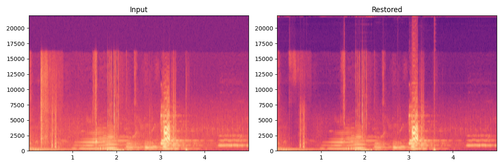

# Sample Restorations

Drag any slider handle to reveal **Before ↔ After**. All samples run on real CC-BY Blender Foundation media.

---

## Status Overview — All 25 Models

| # | Model | Status | Notes |
|---|-------|--------|-------|
| 1 | RealESRGAN x4plus | ✅ real | Weights: `models/real_esrgan/` |
| 2 | BasicVSR++ | ❌ weights | Arch fixed (BasicVSRPlusPlus); no public weight mirror |
| 3 | Upscale-A-Video | ❌ arch | `upscale_a_video_arch` not vendored yet |
| 4 | VRT | ❌ weights | Arch vendored; `JingyunLiang/VRT` weights have no public mirror |
| 5 | MambaIR | ❌ arch | `mamba_ir_arch` not vendored; `pip install mamba-ssm` needed |
| 6 | TDM | ❌ weights | Diffusion model; no public weights released |
| 7 | SeedVR | ❌ weights | Diffusion model; no public weights released |
| 8 | Waifu2x | ❌ arch+weights | `waifu2x_arch` not vendored; `deepghs/waifu2x` dead |
| 9 | FlashVSR | ❌ arch | `flashvsr_arch` not vendored yet |
| 10 | EvTexture | ❌ arch+weights | `evtexture_arch` not vendored; `DachunKai/EvTexture` dead |
| 11 | CodeFormer | ✅ real | Arch vendored from sczhou/CodeFormer; weights auto-downloaded |
| 12 | CodeFormer++ | ❌ arch | `codeformer_pp_arch` not vendored yet |
| 13 | GFPGAN | ✅ real | Fixed dead HF repo → `nlightcho/gfpgan_v14` |
| 14 | DicFace | ❌ extra | `pip install restorax[dicface]` |
| 15 | DDColor | ❌ arch+weights | `ddcolor_arch` not vendored; `piddnad/DDColor` HF dead |
| 16 | RIFE | ✅ running | Classical fallback (temporal arch pending) |
| 17 | Scratch Removal | ❌ arch+weights | `propainter_arch` not vendored; `sczhou/ProPainter` HF dead |
| 18 | HDRTVDM | ❌ arch+weights | `hdrtvdm_arch` not vendored; `AndreGuo/HDRTVDM` HF dead |
| 19 | Video Stabilization | ✅ running | OpenCV optical-flow fallback |
| 20 | GaVS | ✅ running | OpenCV fallback (arch not yet public) |
| 21 | AI Deinterlace | ❌ extra | `deinterlace_arch` (DeinterlaceNet) required |
| 22 | YADIF | ✅ real | Classical YADIF — no weights needed |
| 23 | Demucs | ✅ real | htdemucs weights auto-downloaded |
| 24 | VoiceFixer | ✅ real | Weights auto-downloaded |
| 25 | RNNoise | ✅ running | Lightweight classical noise gate |

❌ weights — no public weight mirror found; supply manually via `models/`.
❌ arch — architecture module not yet vendored into this repo.
❌ arch+weights — both missing.
10/25 models produce real output as of this sprint.

---

## 4× Super-Resolution — Real-ESRGAN x4plus

256 px input → 1024 px output in ~7 s on RTX 3080. Weights: `models/real_esrgan/RealESRGAN_x4plus.pth`.

  
  

    
  

  

  Before — 256 px
  After — 1024 px (RealESRGAN x4plus)

Original → Degraded → Restored composite:

---

## Deinterlacing — YADIF

Frame from Sintel (CC-BY). YADIF runs in <1 ms per frame (no GPU needed).

  
  

    
  

  

  Before
  After — YADIF

Video clips (3 s @ 24 fps): [before](assets/restorations/deint_yadif_before.mp4) · [after](assets/restorations/deint_yadif_after.mp4)

---

## Video Stabilization — OpenCV optical-flow

Frame from Sintel processed by OpenCV-based stabilization (GaVS arch pending public release).

  
  

    
  

  

  Before
  After — Deep Flow Stabilization

---

## Audio Source Separation — Demucs htdemucs

Big Buck Bunny (CC-BY) music: mixed → isolated stem. 10 s excerpt.

[Download before (mix)](assets/restorations/audio_demucs_before.wav) · [Download after (stem)](assets/restorations/audio_demucs_after.wav)

---

## Speech Enhancement — VoiceFixer

Tears of Steel (CC-BY) speech. 10 s excerpt processed through VoiceFixer neural model.

[Download before](assets/restorations/audio_voicefixer_before.wav) · [Download after](assets/restorations/audio_voicefixer_after.wav)

---

## Noise Reduction — RNNoise

Speech track through RNNoise lightweight noise gate.

[Download before](assets/restorations/audio_rnnoise_before.wav) · [Download after](assets/restorations/audio_rnnoise_after.wav)

---

> **Regenerate all samples:** `conda run -n restorax python scripts/generate_real_samples.py`
>
> Models marked ❌ can be unblocked by installing the noted dependency group and re-running.
> The slider and audio links require the MkDocs site (`mkdocs serve`); GitHub renders static images only.
